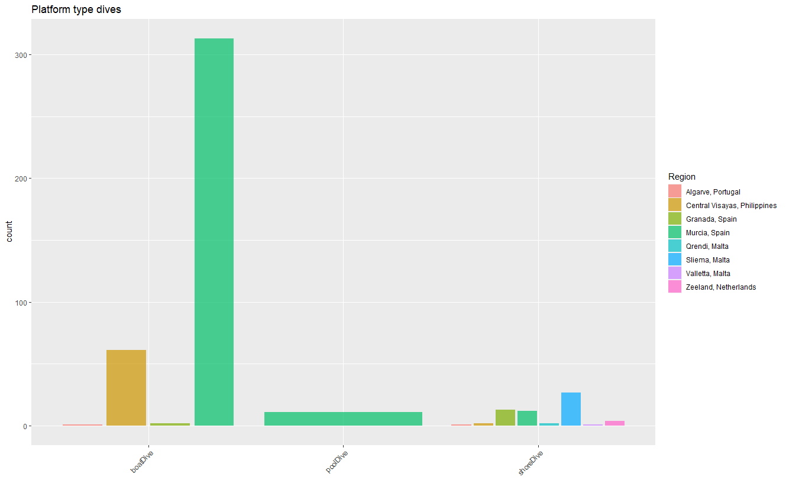

# SCUBA logbook

The aim of this repository is the creation of maps and graphs to visualize a diving logbook.
Some plots will seem incomplete because of the lack of high quality data in the dataset, for example, maximumDepthInMeters, locationID and bottomTime were not recorded for all the dives.

## Dives distribution map

Access the interactive map here:
<a href="https://rubenpp7.github.io/" target="_blank">https://rubenpp7.github.io/</a> <i> open it in a new tab </i>

***

## Logged dives depths

  

***

## Cumulative number of dives
I was pretty bored and couldn't get to do a nice simple cumulative with my crappy data so there you got and hard-to-understand fancy mega-plot.
<i> The blue vertical dashed lines mark the date when I completed my OWD, AOWD, Rescue and Divemaster courses </i>

  

***
***  
***

## Dives per country and region

***

## Dive sites depths variation

***

## Platform type dives

***

###  Semantic versioning
Use [semantic versioning](https://semver.org/), i.e. 

* 1.0.0 first version

* 1.0.2 small changes or bug fixes

* 1.2.x bigger changes

* 2.x.x huge changes

***  
***

<!-- ### Contact -->
<!-- * [Twitter](https://twitter.com/maikspaik) -->
<!-- * [Instagram](https://www.instagram.com/ruben.pperez/?hl=en) -->
