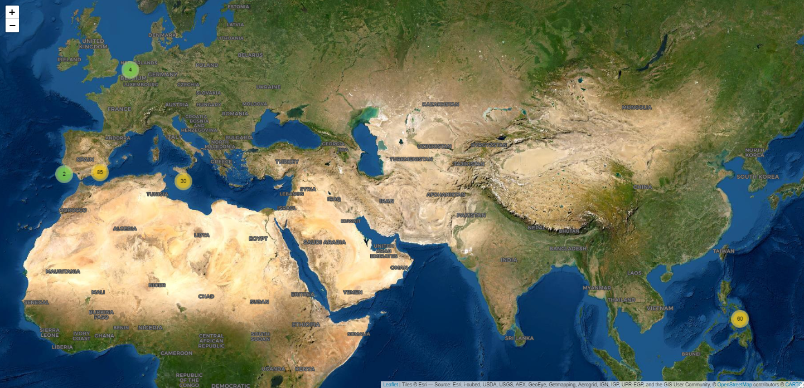

# SCUBA logbook

The aim of this repository is the creation of maps and graphs extracted from a dive logbook.

## Dives distribution map

Access the interactive map here:
<https://rubenpp7.github.io/>

## Dive sites depths variation

## Logged dives depths

