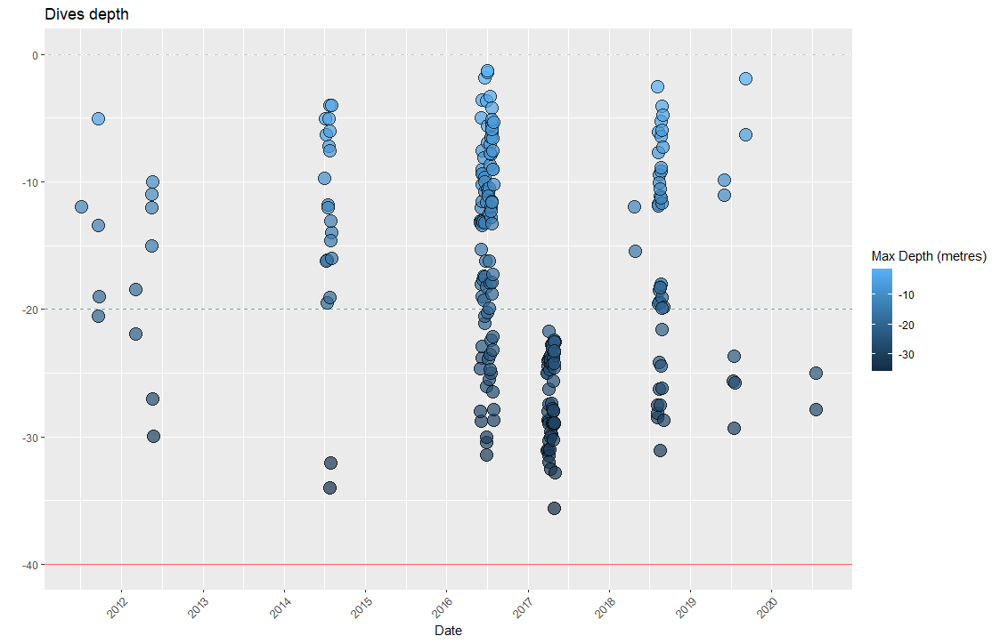

# Divewatchr R package

The aim of this repository is the creation and development of the `divewatchr` R package for a thorough visualization and exploration of a SCUBA Diving Logbook, focusing on  spatio-temporal and categorical plots and maps.


The following images shown here belong to my own logbook and will seem incomplete because of the lack of high quality data in the dataset, for example, maximumDepthInMeters, locationID and bottomTime were not recorded for all the dives. <i>"This lack of data depends only on the database and not on the functions"</i>


- [Installation](#installation)
- [Usage](#usage)
- [Dives distribution map](#dives-distribution-map)
- [Logged dives depths](#logged-dives-depths)
- [Cumulative number of dives](#cumulative-number-of-dives)
- [Number of dive types](#number-of-dive-types)
- [Dives per country and region](#dives-per-country-and-region)
- [Dive sites depths variation](#dive-sites-depths-variation)
- [Platform type dives](#platform-type-dives)
- [Semantic versioning](#semantic-versioning)


## Installation

Installing `divewatchr` requires the `devtools` package:

```r
install.packages("devtools")
devtools::install_github("rubenpp7/divewatchr")
library(divewatchr)
```  

## Usage

To create an `.html` file with and overview of your diving logbook just include the Google spreadsheet URL ID of your dataset to the `data` argument of the following function:
```r
divewatch(data = "1PpXTVS8LdzbvwLHyAAhR2MdT9Iwdy-hiqJknUzF7Yqo")
``` 
Visualize then your `.html` file in a Web browser to explore your data.

As a matter of example you can access my own Divewatchr report <a href="https://rubenpp7.github.io/" target="_blank">here</a> 
(<i>feel free to explore each tab and click and hover over the dive points of the interactive map to find more information about each dive</i>)

<br/><br/>

### How does it work?
The `divewatch` function works on the following functions to transform a diving logbook stored in a Google Spreadsheets document into a web diving CV

***

#### <i>Data load</i>
The `prep_data()` function loads data from a dive logbook located in a Google Sheets site, e.g. [example logbook dataset](https://docs.google.com/spreadsheets/d/1PpXTVS8LdzbvwLHyAAhR2MdT9Iwdy-hiqJknUzF7Yqo/edit#gid=1795885743) <i> open it in a new tab </i>

<i>If no Google Sheets URL is added, a mock dataset will be automatically loaded so the package functions work on the mock dataset</i>
```r
prep_data("1PpXTVS8LdzbvwLHyAAhR2MdT9Iwdy-hiqJknUzF7Yqo") # Google Sheets URL ID
# or
prep_data()
```
This function creates a table like the following one that will be used by the other functions of the package to make the logbook visualizations:

```
   rowid  eventDate maximumDepthInMeters bottomTime            locationID     locality region country decimalLatitude decimalLongitude platformType                    diveType      diveClass
      89 2016-07-25                 16.2         44               El Tubo      Aguilas Murcia   Spain        37.38640        -1.587075     boatDive            Fun Dive Leading   Dive Leading
      90 2016-07-26                 11.6         26           El Castillo      Aguilas Murcia   Spain        37.40018        -1.584053     boatDive            PADI DSD Leading Course Leading
      91 2016-07-27                 20.5         28  La Cresta del Fraile      Aguilas Murcia   Spain        37.40746        -1.548604     boatDive            Fun Dive Leading   Dive Leading
      92 2016-07-27                 20.3         32  Pared Sur del Fraile      Aguilas Murcia   Spain        37.40743        -1.547101     boatDive            Fun Dive Leading   Dive Leading
      93 2016-07-28                  3.6         28       La Casica Verde      Aguilas Murcia   Spain        37.39499        -1.601721    shoreDive            PADI DSD Leading Course Leading
      94 2016-07-30                 30.5         44  La Cresta del Fraile      Aguilas Murcia   Spain        37.40746        -1.548604     boatDive                 Deep Course       Training
      95 2016-07-30                   30         37  Pared Sur del Fraile      Aguilas Murcia   Spain        37.40743        -1.547101     boatDive                 Deep Course       Training
      96 2016-07-31                 31.4         32            El Montoya Cabo de Cope Murcia   Spain        37.41489        -1.516553     boatDive                 Deep Course       Training
      97 2016-07-31                   26         37 La Cueva de la Virgen Cabo de Cope Murcia   Spain        37.42451        -1.500004     boatDive Deep Course / Nitrox Course       Training
      98 2016-07-31                 10.5         38           El Hornillo      Aguilas Murcia   Spain        37.40659        -1.559013     boatDive            PADI DSD Leading Course Leading

```
<br/><br/>

#### <i>Dives distribution map</i>

To create an interactive map of the loaded logbook you can use the following function:
```r
logbook_map()

```


***
<br/><br/>

#### <i>Logged dives depths</i>

To create a scatterplot with the logged depths over time of the loaded logbook you can use the following function:

```r
logged_depths()

```
  

***
<br/><br/>

#### <i>Cumulative number of dives</i>

To create a cumulative plot of the number of dives over time of the loaded logbook you can use the following function:
```r
cum_dives()

```
This function actually displays 4 different plots on top of each other creating a relatively-hard-to-understand fancy mega-plot (unnecessary whim of mine).
<i> The blue vertical dashed lines mark the dates when I completed my OWD, AOWD, Rescue and Divemaster courses </i>


  

***
***  
***
<br/><br/>

#### <i>Number of dive types</i>

To create a barplot with the number of dive types or categories of the loaded logbook you can use the following function:

```r
divetypes( n.other = 4) 

```
<i>The `n.other` argument sets the number of dives under which a `diveType` is placed into the `Other` category.</i>


***
<br/><br/>

#### <i>Dives per country and region</i>

To create a barplot with the number of dives per region and country of the loaded logbook you can use the following function:
```r
divecount_reg()

```


***
<br/><br/>

#### <i>Dive sites depths variation</i>

To create a boxplot with the depth variation of each divesite of the loaded logbook you can use the following function:
```r
divesite_depths(toofew = 1)

```
<i>The `toofew` argument sets the number of logged dives per divesite under which a divesite is excluded from the boxplot for having too few dives for an appropriate interpretation of the depth variation.</i>


***
<br/><br/>

#### <i>Platform type dives</i>

To create a barplot with the number of dives per platform type (<i>shore, boat or pool</i>) and region of the loaded logbook you can use the following function:
```r
divetypes_platform()

```


***
<br/><br/>

###  Semantic versioning
This repository uses [semantic versioning](https://semver.org/), i.e. 

* 1.0.0 first version

* 1.0.2 small changes or bug fixes

* 1.2.x bigger changes

* 2.x.x huge changes

***  
***

<!-- ### Contact -->
<!-- * [Twitter](https://twitter.com/rubenperper) -->
<!-- * [Instagram](https://www.instagram.com/ruben.pperez/?hl=en) -->
