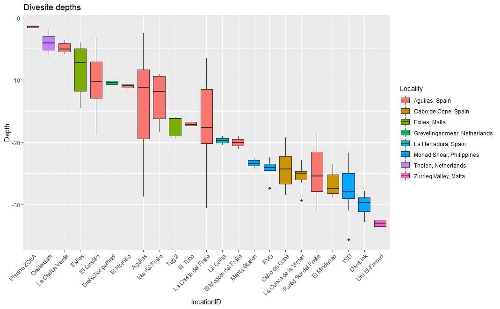

# SCUBA logbook

The aim of this repository is the creation of maps and graphs extracted from a dive logbook.

## Dives distribution map

Access the interactive map here:
<a href="https://rubenpp7.github.io/" target="_blank">https://rubenpp7.github.io/</a> <i> open it in a new tab </i>

***

## Dive sites depths variation

***

## Logged dives depths

  

***
***  
***

###  Semantic versioning
Use [semantic versioning](https://semver.org/), i.e. 

* 1.0.0 first version

* 1.0.2 small changes or bug fixes

* 1.2.x bigger changes

* 2.x.x huge changes
