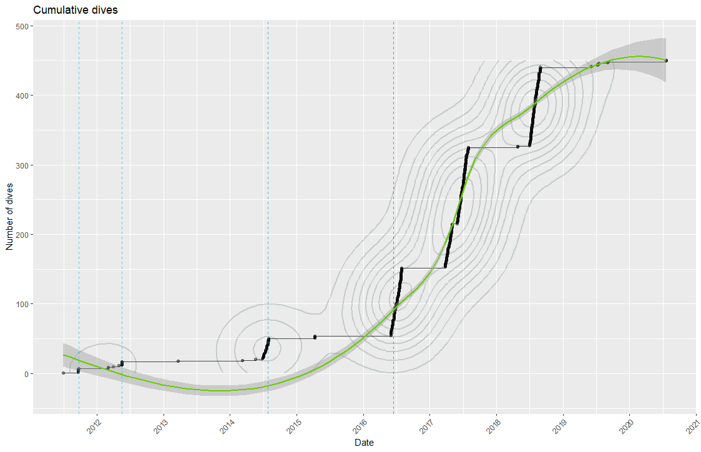

# Divewatchr R package

The aim of this repository is the creation of a R package for a thorough visualization and exploration of a SCUBA Diving Logbook, including spatio-temporal and categorical plots and maps.


The following images shown here will seem incomplete because of the lack of high quality data in the dataset, for example, maximumDepthInMeters, locationID and bottomTime were not recorded for all the dives. This depends only on the database and not on the functions


- [Installation](#installation)
- [Dives distribution map](#dives-distribution-map)
- [Logged dives depths](#logged-dives-depths)
- [Cumulative number of dives](#cumulative-number-of-dives)
- [Number of dive types](#number-of-dive-types)
- [Dives per country and region](#dives-per-country-and-region)
- [Dive sites depths variation](#dive-sites-depths-variation)
- [Platform type dives](#platform-type-dives)
- [Semantic versioning](#semantic-versioning)


## Installation

Installing `divewatchr` requires the `devtools` package:

```r
install.packages("devtools")
devtools::install.github("rubenpp7/divewatchr")
library(divewatchr)
```
#### Data load 
The `prep_data()` function loads data from a dive logbook located in a Google Sheets site.
<i>if no Google Sheets URL is added, a mock dataset will be automatically loaded so the package functions work on the mock dataset</i>
```r
prep_data("1PpXTVS8LdzbvwLHyAAhR2MdT9Iwdy-hiqJknUzF7Yqo")
# or
prep_data()
```


```
   rowid  eventDate maximumDepthInMeters bottomTime            locationID     locality region country decimalLatitude decimalLongitude platformType                    diveType      diveClass
      89 2016-07-25                 16.2         44               El Tubo      Aguilas Murcia   Spain        37.38640        -1.587075     boatDive            Fun Dive Leading   Dive Leading
      90 2016-07-26                 11.6         26           El Castillo      Aguilas Murcia   Spain        37.40018        -1.584053     boatDive            PADI DSD Leading Course Leading
      91 2016-07-27                 20.5         28  La Cresta del Fraile      Aguilas Murcia   Spain        37.40746        -1.548604     boatDive            Fun Dive Leading   Dive Leading
      92 2016-07-27                 20.3         32  Pared Sur del Fraile      Aguilas Murcia   Spain        37.40743        -1.547101     boatDive            Fun Dive Leading   Dive Leading
      93 2016-07-28                  3.6         28       La Casica Verde      Aguilas Murcia   Spain        37.39499        -1.601721    shoreDive            PADI DSD Leading Course Leading
      94 2016-07-30                 30.5         44  La Cresta del Fraile      Aguilas Murcia   Spain        37.40746        -1.548604     boatDive                 Deep Course       Training
      95 2016-07-30                   30         37  Pared Sur del Fraile      Aguilas Murcia   Spain        37.40743        -1.547101     boatDive                 Deep Course       Training
      96 2016-07-31                 31.4         32            El Montoya Cabo de Cope Murcia   Spain        37.41489        -1.516553     boatDive                 Deep Course       Training
      97 2016-07-31                   26         37 La Cueva de la Virgen Cabo de Cope Murcia   Spain        37.42451        -1.500004     boatDive Deep Course / Nitrox Course       Training
      98 2016-07-31                 10.5         38           El Hornillo      Aguilas Murcia   Spain        37.40659        -1.559013     boatDive            PADI DSD Leading Course Leading

```


## Dives distribution map

Access the interactive map here:
<a href="https://rubenpp7.github.io/" target="_blank">https://rubenpp7.github.io/</a> <i> open it in a new tab </i>
```r
logbook_map()

```


***


## Logged dives depths


```r
logged depths()

```
  

***


## Cumulative number of dives
Cumulative hard-to-understand fancy mega-plot.
<i> The blue vertical dashed lines mark the date when I completed my OWD, AOWD, Rescue and Divemaster courses </i>

```r
cum_dives()

```
  

***
***  
***


## Number of dive types

```r
divetypes()

```


***


## Dives per country and region

```r
divecount_reg()

```


***


## Dive sites depths variation

```r
divesite_depths()

```


***


## Platform type dives

```r
divetypes_platform()

```


***


###  Semantic versioning
Use [semantic versioning](https://semver.org/), i.e. 

* 1.0.0 first version

* 1.0.2 small changes or bug fixes

* 1.2.x bigger changes

* 2.x.x huge changes

***  
***

<!-- ### Contact -->
<!-- * [Twitter](https://twitter.com/maikspaik) -->
<!-- * [Instagram](https://www.instagram.com/ruben.pperez/?hl=en) -->
